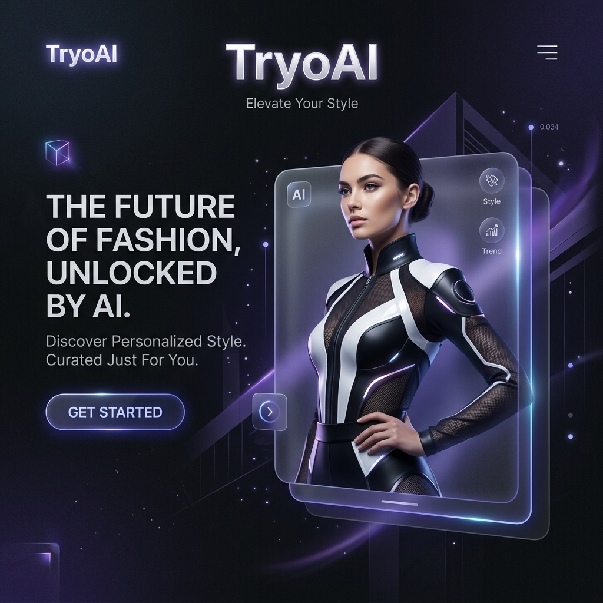

# <div align="center"></div>

<div align="center">
  <h1>✨ TryoAI ✨</h1>
  <p><b>The Future of Luxury Fashion: Next-Gen AI Virtual Try-On Platform</b></p>
  <p>
    
    
    
    
    
  </p>
</div>

---

## 📖 Overview

**TryoAI** is a premium, state-of-the-art AI-driven fashion platform designed to redefine the digital retail experience. By merging high-end editorial aesthetics with cutting-edge neural physics, TryoAI allows users to visualize luxury garments with unprecedented cinematic accuracy.

Built for global fashion houses and enterprise retail, the platform bridges the gap between physical boutiques and digital shopping through immersive, motion-rich interfaces and real-time AI synthesis.

---

## 🚀 Key Features

### 🧵 Neural Cloth Physics
Experience fabric drape and flow that reacts to every posture. Our proprietary engine simulates real-world garments with pixel-perfect accuracy, providing a true-to-life fitting experience across all luxury apparel categories.

### 🪄 AI Fashion Evolution (TryoMagic)
Harness the power of **TryoMagic** to transform silhouettes instantly. Our 8K Neural Synthesis engine allows for seamless garment swapping and "before/after" comparisons that feel magical.

### 📱 Omnichannel Ecosystem
Deploy a consistent luxury experience across:
- **Web & Mobile**: High-fidelity neural fitting in any browser.
- **Smart Mirrors**: Synchronize physical showroom mirrors with digital app states.
- **B2B Showrooms**: Tailored experiences for executive clientele and bespoke fittings.

### 📊 Enterprise Scale & SDK
- **Global SDK Access**: Deploy our luxury try-on engine in less than 48 hours.
- **Advanced Analytics**: Gain deep insights into customer preferences and conversion drivers.
- **Zero-Latency Rendering**: Distributed cloud rendering ensures studio-quality results in milliseconds.

---

## 🛠️ Technology Stack

- **Frontend Core**: [React 19](https://react.dev/) + [Vite](https://vitejs.dev/)
- **Animation Engine**: [GSAP (GreenSock)](https://greensock.com/) - ScrollTrigger, TextReveal, and Custom Timelines.
- **Motion UI**: [Framer Motion](https://www.framer.com/motion/) - For seamless page transitions and micro-interactions.
- **Smooth Scrolling**: [Lenis](https://lenis.darkroom.engineering/) - For a buttery-smooth editorial scrolling experience.
- **Styling**: Vanilla CSS with a **Minimalist/Brutalist Typography Design System** (Outfit, Inter, and Playfair Display).
- **Architecture**: Context-based state management with specialized hooks for preloaders and UI states.

---

## 📁 Project Structure

```text
src/
├── assets/             # Global assets (Images, Videos, Frames)
├── components/         # Reusable UI components (Navbar, Footer, TryoMagic)
├── context/            # React Context Providers (Preloader, etc.)
├── pages/              # Main Page Components
│   ├── Home.jsx        # Landing page with Canvas animations
│   ├── Features.jsx    # Detailed capability showcase
│   ├── Platform.jsx    # Ecosystem and B2B metrics
│   └── ...             # About, Contact, Privacy, etc.
├── App.jsx             # Main routing and smooth-scroll init
└── index.css           # Global design system and premium tokens
```

---

## 🚦 Getting Started

### Prerequisites
- [Node.js](https://nodejs.org/) (v18 or higher recommended)
- [npm](https://www.npmjs.com/)

### Installation

1. **Clone the repository**
   ```bash
   git clone https://github.com/your-username/tryoai.git
   cd tryoai
   ```

2. **Install dependencies**
   ```bash
   npm install
   ```

3. **Start the development server**
   ```bash
   npm run dev
   ```

4. **Build for production**
   ```bash
   npm run build
   ```

---

## 💎 Design Philosophy

The website follows a **Premium Editorial** aesthetic:
- **Glassmorphism**: Subtle glow and blurred backgrounds for depth.
- **Typography**: A blend of bold sans-serif headers (Outfit) and elegant serif accents (Playfair Display).
- **Cinematic Motion**: Every scroll interaction and image reveal is orchestrated using GSAP to feel like a high-fashion film.
- **Dark Mode**: A deep, sophisticated charcoal and indigo palette ensuring content remains the hero.

---

<p align="center">
  Built with ❤️ for the future of fashion.
</p>
